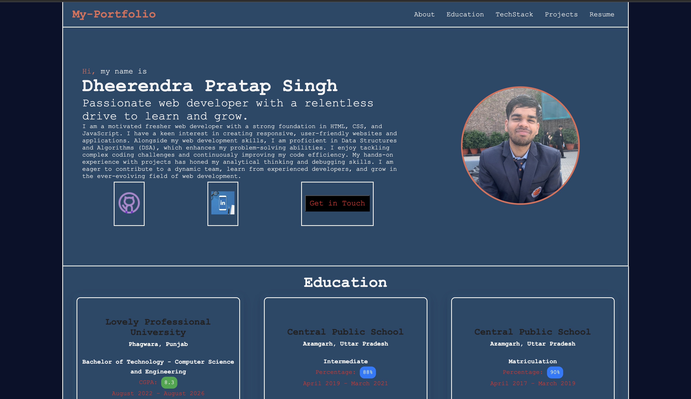

# 💼 React Portfolio Website

A personal portfolio website built with React to showcase my projects, skills, and experience. It includes a modern design with smooth navigation, animations using Framer Motion, and responsive layouts.

### 🔐 Hero Page

--- 
Live Site 👉 [https://dheerendra-dev.netlify.app](https://dheerendra-dev.netlify.app/)

## ✨ Features

- 🧑‍💻 About Me section
- 🛠️ Tools/Tech Stack: HTML, CSS, JavaScript, C, C++, Python
- 💼 Experience (dummy companies listed)
- 📂 Projects: Tic Tac Toe website, To-Do List, and more
- 🧭 Navigation bar for smooth scrolling between sections
- 🎨 Built with React and styled with custom CSS
- ⚡ Framer Motion for animated transitions

---

## 🚀 Technologies Used

- React
- Framer Motion
- HTML, CSS, JavaScript
- Git & GitHub

